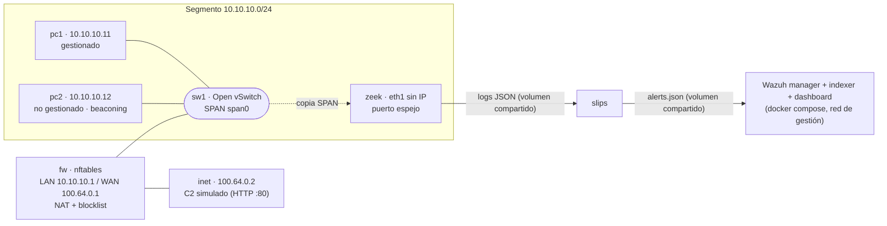

# Laboratorio emulado NDR — Containerlab

Prototipo del segmento del departamento. Se asume un switch con SPAN, firewall con NAT, un equipo gestionado, un equipo no gestionado que emite beaconing hacia un C2 (command and control) simulado y el sensor Zeek + Slips leyendo el tráfico espejado. Las alertas de Slips llegan a Wazuh.

## Topología



| Nodo | Imagen | Rol |
|---|---|---|
| sw1 | `ovs-bridge` (host) | Switch del segmento con port mirroring |
| fw | `alpine:3.20` + nftables | Firewall perimetral: NAT y blocklist con expiración |
| inet | `ghcr.io/hellt/network-multitool` | Destino externo / servidor C2 |
| pc1 | `ghcr.io/hellt/network-multitool` | Equipo gestionado |
| pc2 | `ghcr.io/hellt/network-multitool` | Equipo no gestionado con beaconing |
| zeek | `zeek/zeek:latest` | Captura pasiva y generación de logs |
| slips | `stratosphereips/slips:latest` | Análisis de comportamiento |

Hay dos planos separados. El plano de datos (10.10.10.0/24 y 100.64.0.0/24) es lo único que ve Zeek. El plano de gestión (`clab-ndr-mgmt`, 172.30.30.0/24) lo crea Containerlab y en él se conecta Wazuh.

## Estructura del repositorio

| Ruta | Contenido |
|---|---|
| `ndr-lab.clab.yml` | Topología de Containerlab |
| `scripts/` | Preparación del host, configuración del laboratorio y sesión SPAN |
| `configs/` | Configuración de cada componente: firewall, Zeek, beacon, Slips y Wazuh |
| `tests/fixtures/` | Alertas de Slips de referencia para probar las reglas de Wazuh |
| `docs/` | Notas del laboratorio, bitácora y documentos de diseño |
| `logs/` | Salida de Zeek y Slips (no se versiona) |

## Requisitos del host

Linux, Docker, Containerlab y Open vSwitch (lo instala `host-prep.sh`). Con Wazuh incluido se estiman 16 GB de RAM y 8 vCPU.

## Puesta en marcha

### 1. Laboratorio

```bash
sudo ./scripts/host-prep.sh                  # una vez por host: OVS, bridge sw1, sysctl
sudo containerlab deploy -t ndr-lab.clab.yml # crea nodos y enlaces, sin configuración de red
sudo ./scripts/config-lab.sh                 # IPs, NAT, nginx, SPAN, Zeek y beacon
```

La configuración va en un paso posterior al deploy porque las interfaces conectadas al bridge OVS se reemplazan después del arranque de los nodos: una IP asignada con `exec` desaparece y un Zeek iniciado al arrancar queda escuchando una interfaz obsoleta. `config-lab.sh` es idempotente: puede repetirse sin duplicar IPs, Zeek ni beacons.

Al terminar, `config-lab.sh` muestra una verificación. Lo esperado es:

```
  SPAN       : OK
  pc1 -> fw  : OK
  pc1 -> C2  : HTTP 200
```

### 2. Wazuh

Wazuh se despliega aparte con el `docker compose` single-node oficial. El laboratorio debe estar arriba antes, porque crea la red de gestión a la que se conecta el manager.

```bash
git clone --depth 1 --branch v4.14.7 https://github.com/wazuh/wazuh-docker.git
cd wazuh-docker/single-node
docker compose -f generate-indexer-certs.yml run --rm generator
cd ../..

export NDR_DIR=$PWD
cp configs/wazuh/docker-compose.override.yml wazuh-docker/single-node/
cd wazuh-docker/single-node && docker compose up -d
```

El archivo `docker-compose.override.yml` conecta el manager a la red de gestión y le monta tres cosas: la carpeta de alertas de Slips, `ossec.conf` (con el bloque que lee `alerts.json`) y `local_rules.xml` (la regla 100200).

### 3. Slips

Slips se inicia a mano dentro de su contenedor, en modo creciente sobre la corrida actual de Zeek:

```bash
docker exec -it clab-ndr-lab-slips bash
./slips.py -c config/ndr-slips.yaml -g "$(readlink -f /zeek_logs/current)" -i eth0 -o /slips_output/live
```

- `-c` usa la configuración de `configs/slips/slips.yaml`, que la topología monta en el contenedor.
- `-g` lee un directorio de Zeek que sigue creciendo y exige indicar una interfaz con `-i`.
- `current` es un enlace simbólico y Slips 1.1.23 no lo reconoce como directorio, por eso se pasa la ruta resuelta con `readlink -f`.

### Detener todo

```bash
cd wazuh-docker/single-node && docker compose down
cd ../..
sudo containerlab destroy -t ndr-lab.clab.yml --cleanup
sudo ./scripts/span.sh off
```

## Verificación del flujo

Cada ejecución de Zeek escribe en `logs/zeek/run-<fecha>/` y `logs/zeek/current` apunta a la última.

```bash
# 1. Zeek registra el beacon: conexiones SF / http cada ~30 s desde 10.10.10.12
jq -c 'select(."id.resp_h"=="100.64.0.2") | {ts, src:."id.orig_h", conn_state, service}' logs/zeek/current/conn.log

# 2. El espejo entrega tráfico al puerto de Zeek (lado host)
sudo tcpdump -ni zeek-eth1 -c 10 'tcp port 80'

# 3. Slips genera alertas
wc -l logs/slips/live/alerts/alerts.json

# 4. Wazuh las convierte con la regla 100200
docker exec single-node-wazuh.manager-1 grep -c '"id":"100200"' /var/ossec/logs/alerts/alerts.json
```

En el paso 1 Zeek ve la IP interna real (10.10.10.12) y no la IP posterior al NAT (100.64.0.1): la captura queda antes de la traducción de direcciones.

Una regla se puede probar sin esperar tráfico, pasando una alerta de referencia al probador de Wazuh:

```bash
head -1 tests/fixtures/slips-alerts-baseline.json | docker exec -i single-node-wazuh.manager-1 /var/ossec/bin/wazuh-logtest
```

## Prueba manual de bloqueo con reversión

```bash
docker exec clab-ndr-lab-fw nft add element inet ndr blocklist '{ 10.10.10.12 timeout 2m }'
docker exec clab-ndr-lab-pc2 curl -m 3 http://100.64.0.2/    # debe fallar
docker exec clab-ndr-lab-fw nft list set inet ndr blocklist
docker exec clab-ndr-lab-fw nft delete element inet ndr blocklist '{ 10.10.10.12 }'   # reversion manual
```

## Limitaciones conocidas

- **Slips se inicia a mano.** Es el único componente que `config-lab.sh` no arranca.
- **Wazuh omite las alertas previas.** Si `alerts.json` aparece después de que el manager arrancó, este lo lee desde el final y solo procesa las alertas posteriores.
- **Slips deduce mal la red local.** Con `-i eth0` toma la red de gestión (172.30.30.0/24) como red local y marca con severidad alta tráfico legítimo dentro del segmento 10.10.10.0/24.
- **Slips no clasifica el beacon como C2** con la configuración por defecto. El modelo `ml_linear_model` sí marca esos flujos, pero con nivel bajo.
- **El SPAN de Open vSwitch no pierde paquetes bajo carga**, a diferencia de un puerto SPAN físico. Las mediciones del laboratorio no son comparables con producción en ese aspecto.
- **Las imágenes de Zeek y Slips usan `latest`.** Falta fijar versiones para que los experimentos sean reproducibles.
- **RITA y MISP** aún no forman parte del laboratorio.

El detalle de cada hallazgo y de las decisiones de diseño está en `docs/notas-laboratorio.md`.
